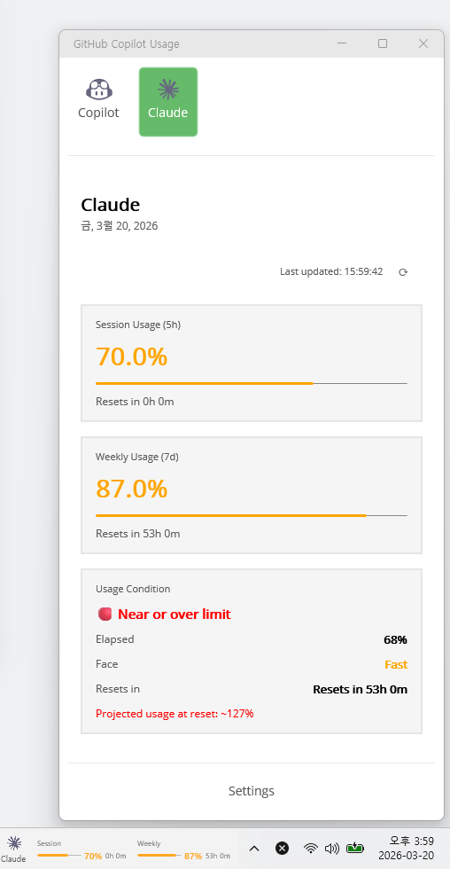

# GitHub Copilot Usage MAUI

**GitHub Copilot** 및 **Claude Code**의 사용량을 모니터링하고 분석하기 위해 .NET MAUI 및 MauiReactor로 제작된 크로스 플랫폼 애플리케이션입니다. 일일 사용량, 모델별 통계, 잔여 할당량 등을 대시보드 형태로 제공합니다.

## ⚠️ 필수 사전 준비 (Prerequisites)

이 애플리케이션은 사용자 인증 및 GitHub API 연동을 위해 **GitHub CLI (`gh`)가 반드시 시스템에 설치되어 있어야 합니다.** 

### 1. GitHub CLI 설치
[https://cli.github.com/](https://cli.github.com/) 에서 운영체제에 맞는 버전을 다운로드하고 설치하세요.
- Windows의 경우 PowerShell에서 패키지 매니저로도 설치할 수 있습니다:
  ```bash
  winget install --id GitHub.cli
  ```

### 2. GitHub CLI 로그인 (권한 설정)
설치가 완료된 후, 터미널(또는 PowerShell)을 열고 **아래 명령어를 통해 반드시 로그인을 진행**해주세요.
```bash
gh auth login -h github.com -s user -w
```
> 💡 **중요:** 이 앱이 사용하는 Copilot Billing API를 조회하기 위해서는 기본 권한 외에 `user` 스코프 권한이 반드시 필요합니다. 위 명령어처럼 `-s user` 옵션을 포함하여 로그인해야 정상적으로 정보를 불러올 수 있습니다. 앱 내에서도 권한 갱신 기능(🔑 버튼)을 제공합니다.

### 3. 개발 환경
- .NET 9.0 SDK 이상
- .NET MAUI 워크로드 (`dotnet workload install maui`)

---

## ✨ 핵심 기능

- **실시간 대시보드:** 이번 달 총 사용량(Requests), 잔여 할당량, 일별 권장 사용량 페이스 확인
- **목표 대비 추이:** 현재 진행 속도 기준으로 월말 예상 사용량 및 할당량 소진 예상일 도출
- **모델별 사용량 분석:** GPT-4, GPT-3.5 등 백엔드에서 사용된 각 모델의 비율(%) 제공
- **앱 내 인증 관리:** 토큰 또는 권한 만료 시 앱 내 패널에서 `gh auth refresh` 흐름을 지원
- **Claude Code 지원:** GitHub Copilot과 함께 Claude Code 사용량 및 통계 모니터링
- **자동 새로고침:** 10분, 30분, 1시간 간격으로 데이터 자동 갱신 지원
- **시스템 트레이 지원:** 윈도우 작업 표시줄(트레이)에 최소화하여 백그라운드 모니터링 가능

## 🚀 빌드 및 실행

> 🔔 현재 프로젝트는 **Windows 전용**으로 개발 및 검증되었습니다. 타 플랫폼(Mac Catalyst, iOS, Android)에서는 정상 동작이 보장되지 않습니다.

프로젝트 경로에서 아래의 명령어를 입력하여 빌드 및 실행할 수 있습니다.

### Windows
```bash
dotnet build
dotnet run -f net9.0-windows10.0.19041.0
```

